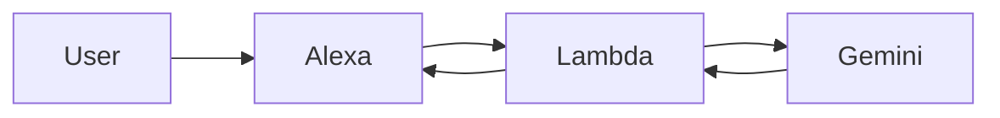

# Alexa × Gemini Chat Skill

AlexaとGoogle Geminiを使った雑談スキルです。

## Overview
音声で話しかけると、Geminiが自然な返答を生成します。

## Architecture

## Setup（ざっくり）

1. Alexaスキル作成
2. Lambda関数作成（Python）
3. Gemini APIキー設定
4. AlexaとLambdaを連携

## Usage

Alexaを起動して話しかけるだけ

## Notes

- Lambdaのタイムアウトは10秒以上推奨
- APIキーは環境変数で管理

## License
MIT
