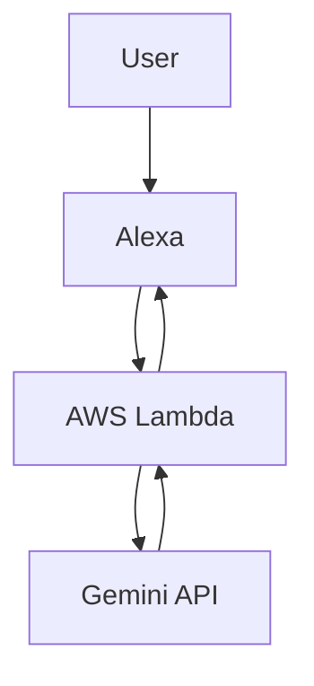

# Amazon Alexa × Google Gemini で雑談できるスキルを作る

Alexaで「自由に会話できる」スキルを作ってみました。  
Google Geminiを使って、質問に対して自然に返答します。

---

## 🎤 デモ

- 「アレクサ、このスキルを開いて」
- 「サッカーの戦術を教えて」

→ Geminiが自然な日本語で回答

---

## 🧠 構成



---

## 💡 特徴

- 自由入力（anyText）で雑談可能
- Geminiで自然な日本語応答
- サーバーレス（Lambda）
- シンプル構成で学習向き

---

## ⚙️ 必要なもの

- Amazon Developer アカウント
- Google Gemini APIキー
- AWS Lambda（Alexa-hostedでもOK）

---

## 🔑 環境変数

以下を設定してください：

```
GEMINI_API_KEY=your_api_key
```

---

## 🚀 動かし方（ざっくり）

1. Alexaスキルを作成（Custom / Python）
2. 本リポジトリのコードを貼り付け
3. 環境変数を設定
4. デプロイ
5. テストで会話

※詳細手順は今後追記予定

---

## 🧪 実装ポイント

```python
response = client.models.generate_content(
    model="gemini-2.5-flash",
    contents=f"日本語で、短く、音声向けに答えてください。\n質問: {question}"
)
```

- 音声向けに短くするのがコツ
- そのままだと長すぎてAlexaに不向き

---

## ⚠️ 注意

:::note warn
APIキーは絶対にコードに直接書かないでください
:::

---

## 📌 今後やりたいこと

- 会話履歴を持たせる
- ストリーミング対応
- 音声の自然さ改善

---

## 🙌 まとめ

Alexa × Geminiで  
「ちゃんと会話できるスキル」は意外と簡単に作れます。

ぜひ試してみてください。
