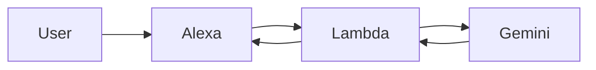

# Alexa × Gemini Chat Skill

AlexaとGoogle Geminiを使って、雑談ができるスキルを作ってみました。

音声で話しかけると、Geminiが自然な日本語で返答します。

---

## 🎯 Overview

- Alexaからの発話を取得
- AWS Lambdaで処理
- Google Gemini APIに問い合わせ
- 音声として返答

シンプルですが、実用的な構成です。

---

## 🏗 Architecture



---

## 🚀 Setup（概要）

1. Alexaスキルを作成
2. Intent（FreeAnswerIntent）を定義
3. AWS Lambda関数を作成
4. Gemini APIキーを設定
5. AlexaとLambdaを連携

---

## 🔑 環境変数

以下の環境変数を設定してください。

```
GEMINI_API_KEY=your_api_key
```

※ APIキーはコードに直接書かないでください

---

## 🧠 Usage

Alexaでスキルを起動し、自由に話しかけてください。

例：
- 「サッカーの戦術について教えて」
- 「おすすめの映画は？」
- 「今日の気分を一言で」

---

## ⚠️ Notes

- Lambdaのタイムアウトは **10秒以上推奨**
- レスポンスを短くすることで安定します
- ネットワーク状況によっては応答が遅れる場合があります

---

## 🛠 Troubleshooting

### タイムアウトする
- Lambdaのタイムアウトを延長してください

### エラーが出る
- APIキーが正しく設定されているか確認してください
- Intent名やスロット設定を見直してください

---

## 📦 Files

- `lambda_function.py` : メイン処理
- `requirements.txt` : 依存関係

---

## ✍️ Article

Qiitaで解説しています👇  
（ここにQiitaリンク貼る）

---

## 📄 License

MIT
